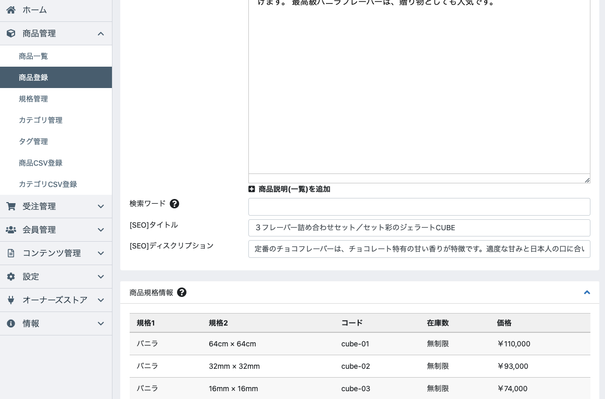
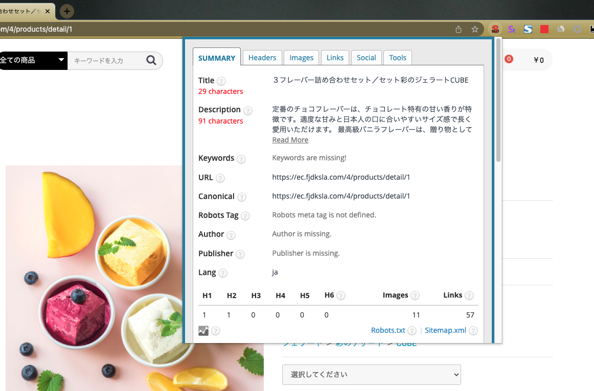

# EC-CUBE4.1用 商品ページ個別SEO設定

商品ページ毎にSEO（Title , Description）設定をするシンプルなプラグインです。

## 特徴

- 商品情報編集画面で、個別のSEOタイトル、SEOディスクリプションが設定できます
- 商品名やサイトタイトル等の自動挿入される文言を書き換えることができます

## イメージ




# インストール方法

```
cd app/Plugin;
git clone https://github.com/cajiya/ec-cube4_product-seo.git;
mv ec-cube4_product-seo ProductSeo;
cd ../../;
php bin/console eccube:plugin:install --code="ProductSeo"
```

